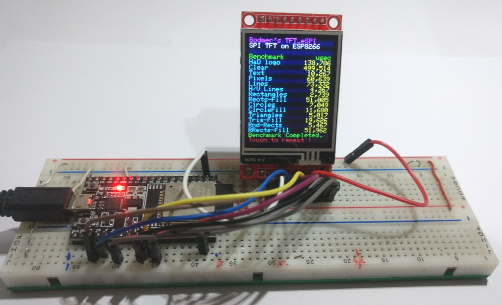
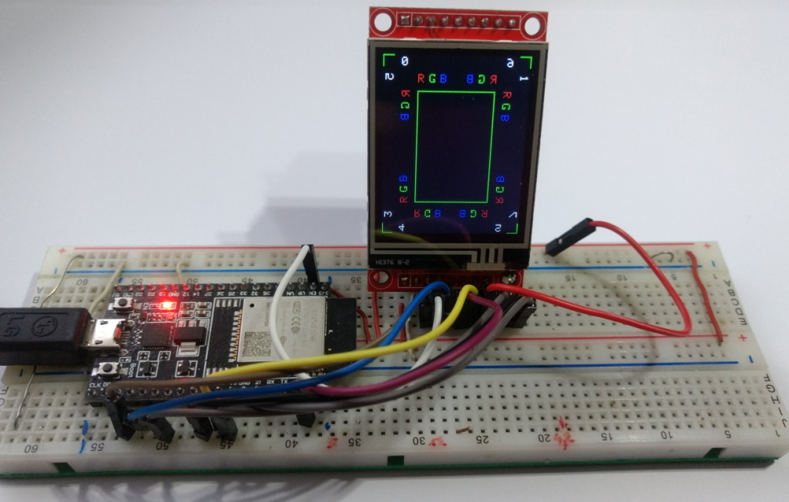
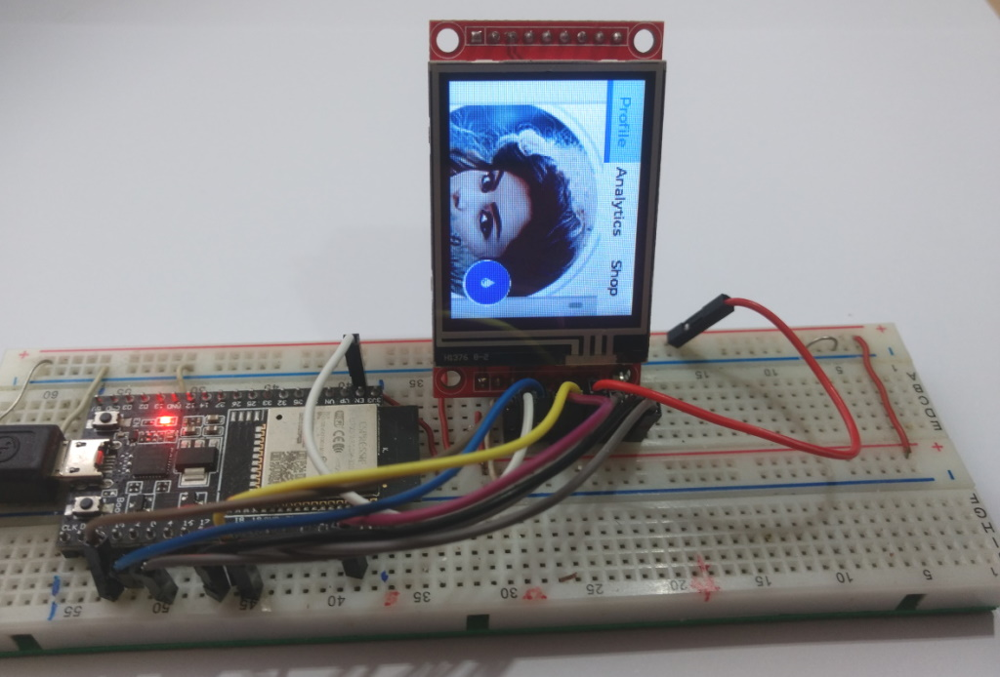

# SPI Touch Display ST7735 1.8" 160x128 XPT2046

Aliexpress Display ~5€, tested with a ESP32 DevKitC V4 and Arduino IDE 2.0.4

Display works with TFT_eSPI by Bodmer, LovyanGFX and LVGL 8.3.6


## Connections for ESP32 DevKitC V4

Share SPI MOSI, MISO and CLK, so you need only 11 or 12 Pin's.

| GPIO | TFT   | Touch | SD-Card |                |
| ---: | :---- | :---- | :------ | :------------- |
| 23   | SDA   | T_DIN | SD_MOSI | MOSI           |
| 19   |       | T_DO  | SD_MISO | MISO           |
| 18   | SCK   | T-CLK | SD_SCK  | CLK            |
|  2   | SDA   |       |         | DC             |
| EN   | RESET |       |         | RST            |
| 15   | CS    |       |         | CS  (TFT)      |
|  5   |       |       | SD_CS   | CS  (SD)       |
|  4   |       | T_CS  |         | CS  (Touch)    |
|      |       | T_IRQ |         | IRQ (not used) |
|      | GND   |       |         | GND            |
|      | VCC   |       |         | 3.3V           |
|      | LED   |       |         | 3.3V           |

## Configure the library TFT_eSPI
- Edit the file : Arduino\libraries\TFT_eSPI\User_Setup.h
- Test : TFT_graphicstest_PDQ3_Touch.ino (works with TFT_eSPI or LovyanGFX)
- Test : LittleFS_SDcard_Touch_Jpeg_Test.ino



Edit Arduino\libraries\TFT_eSPI\User_Setup.h :

```java
#define USER_SETUP_INFO "User_Setup"

// Driver
#define ST7735_DRIVER 
#define TFT_WIDTH  128
#define TFT_HEIGHT 160
#define ST7735_GREENTAB2

// Pins
#define TFT_MISO 19
#define TFT_MOSI 23
#define TFT_SCLK 18
#define TFT_CS   15
#define TFT_DC    2
#define TFT_RST  -1
#define TOUCH_CS  4

// Fonts
#define LOAD_GLCD
#define LOAD_FONT2
#define LOAD_FONT4
#define LOAD_FONT6
#define LOAD_FONT7
#define LOAD_FONT8
//#define LOAD_FONT8N
#define LOAD_GFXFF
#define SMOOTH_FONT

//Other options
#define SPI_FREQUENCY       40000000 
#define SPI_READ_FREQUENCY  20000000
#define SPI_TOUCH_FREQUENCY  2500000
```
## Alternative configuration of the library TFT_eSPI
- Create the new File : Arduino\libraries\TFT_eSPI\User_Setups\Setup401_ST7735_Touch.h
- Edit the file : Arduino\libraries\TFT_eSPI\User_Setup_Select.h

Edit Arduino\libraries\TFT_eSPI\User_Setup_select.h :
```java
// Only **ONE** line below should be uncommented to define your setup.

#include <User_Setup.h>                           // Default setup is root library folder
//#include <User_Setups/Setup401_ST7735_Touch.h>  // new : Setup file for ST7735 with touch
```

## Configure the library LovyanGFX
- Create the file : Arduino\libraries\LovyanGFX\src\LGFX_ESP32_ST7735S.hpp
- Test : Lovyan_Touch_Test.ino and TFT_graphicstest_PDQ3_Touch.ino



LGFX_ESP32_ST7735S.hpp :

```c++
#pragma once

#define  LGFX_USE_V1

#include <LovyanGFX.hpp>

class LGFX :  public lgfx::LGFX_Device
{
  lgfx::Panel_ST7735S  _panel_instance;
  lgfx::Bus_SPI        _bus_instance;
  lgfx::Touch_XPT2046  _touch_instance;
public:
  LGFX(void)
  { // Configure bus control settings.

      auto cfg = _bus_instance.config();
      cfg.spi_host = VSPI_HOST;
      cfg.spi_mode    = 0;
      cfg.freq_write  = 40000000;
      cfg.freq_read   = 16000000;
      cfg.spi_3wire   = true;
      cfg.use_lock    = true;
      cfg.dma_channel = SPI_DMA_CH_AUTO;
      cfg.pin_sclk = 18;            // SPI SCLK
      cfg.pin_mosi = 23;            // SPI MOSI
      cfg.pin_miso = 19;            // SPI MISO    (-1 = disable)
      cfg.pin_dc   =  2;            // SPI D/C A0  (-1 = disable)
      
      _bus_instance.config(cfg);
      _panel_instance.setBus(&_bus_instance);
    }
    { // Set display panel controls.

      auto cfg = _panel_instance.config();

      cfg.pin_cs           =    15;  // CS    (-1 = disable)
      cfg.pin_rst          =    -1;  // RST   (-1 = disable)
      cfg.pin_busy         =    -1;  // BUSY  (-1 = disable)

      cfg.panel_width      =   128;
      cfg.panel_height     =   160;
      cfg.offset_x         =     2;
      cfg.offset_y         =     1;
      cfg.offset_rotation  =     2;
      cfg.dummy_read_pixel =     8;
      cfg.dummy_read_bits  =     1;
      cfg.readable         =  true;
      cfg.invert           = false;
      cfg.rgb_order        =  true;
      cfg.dlen_16bit       = false;
      cfg.bus_shared       =  true;

      _panel_instance.config(cfg);
    }
    { // Configure settings for touch screen control.  (delete if not necessary)

      auto cfg = _touch_instance.config();

      cfg.x_min      =   0;    // numbers doesn't work
      cfg.x_max      = 127;
      cfg.y_min      =   0;
      cfg.y_max      = 159;
    //cfg.pin_int    =  -1;
      cfg.bus_shared = true;
      cfg.offset_rotation = 0;

      _touch_instance.config(cfg);
      _panel_instance.setTouch(&_touch_instance); // Set the touchscreen to the panel.
    }
    setPanel(&_panel_instance); // Sets the panel to use.
  }
};
```
## Configure LVGL 8.3.6 
- First configure the Library TFT_eSPI. 
- Create and edit the file : "Arduino\libraries\lv_conf.h"
  - copy "Arduino\libraries\lvgl\lv_conf_template.h" to "Arduino\libraries\lv_conf.h"
  - Edit "Arduino\libraries\lv_conf.h"
- Modify the lvgl library :
  - Copy folder "Arduino\libraries\lvgl\demos" to "Arduino\libraries\lvgl\ **src**"
  - Edit "Arduino\libraries\lvgl\ **src**\demos\benchmark\lv_demo_benchmark.c"
  - Edit "Arduino\libraries\lvgl\src\demos\keypad_encoder\lv_demo_keypad_encoder.c"
  - Edit "Arduino\libraries\lvgl\src\demos\widgets\lv_demo_widgets.c"
- or download and unzip the modified "lvgl8.3.6.zip" and copy the folder "lvgl" to "Arduino\libraries"
- Test : LVGL_Arduino_Test.ino



Modified lines in Arduino\libraries\lv_conf.h :
```java
#if 1                            /* Set it to "1" to enable content */
#define LV_COLOR_DEPTH 16
#define LV_TICK_CUSTOM 1         // Touch works only with 1
#define LV_USE_LOG 1             // See LVGL-warnings in the serial monitor
#define LV_FONT_MONTSERRAT_8  1  // small fonts for the small display
#define LV_FONT_MONTSERRAT_10 1
#define LV_FONT_MONTSERRAT_12 1
#define LV_FONT_DEFAULT &lv_font_montserrat_10
#define LV_USE_DEMO_WIDGETS 1                   // Enable demos
#define LV_DEMO_WIDGETS_SLIDESHOW 1
#define LV_USE_DEMO_KEYPAD_AND_ENCODER 1
#define LV_USE_DEMO_BENCHMARK 1
```

The LVGL 8.3.3 library, i first used and modified can be downloaded from the link below. It contains the first LVGL_Arduino.ino that I got working without major modifications.

Download "2.8inch_ESP32-2432S028R.rar" from : http://pan.jczn1688.com/directlink/1/ESP32%20module/2.8inch_ESP32-2432S028R.rar?spm=a2g0o.detail.1000023.1.6e8869f0pW0rBB&file=2.8inch_ESP32-2432S028R.rar

<!-- unvisible -->
